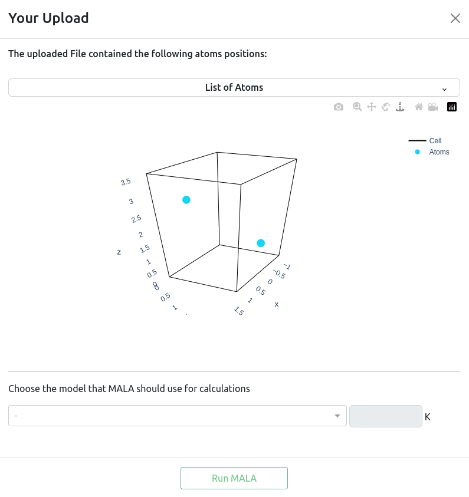
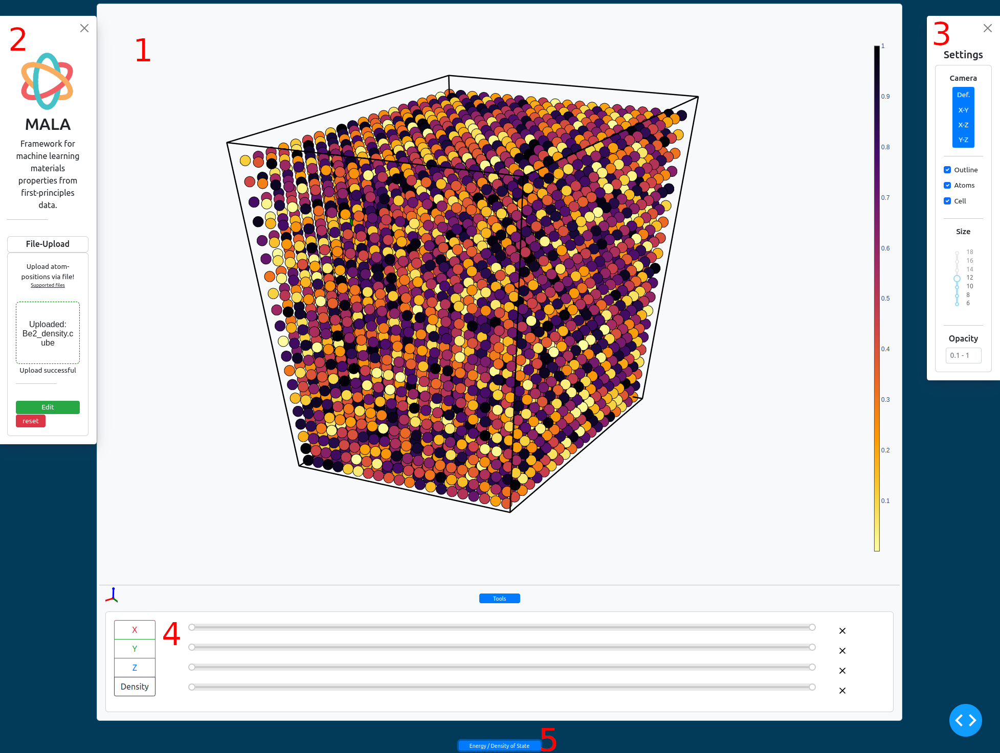

# malaWeb BRANCH render

Web app to visualize on-the-fly MALA predictions.

## Description

malaWeb is a Plotly Dash based web application used for the visualization of 3D volumetric data. By inputting atom positions and cell information in ASE-accepted data formats, MALA can be run to make predictions on the volumetric data inside the given cell. This branch is used to test hosting capabilities on the free hosting service [render](https://render.com/). The free plan does not seem to allow compiling of external libraries like MALA, lammps, QE etc. Eventhough MALA can be installed via pip, lammps and QE can't (in a compatible way). It seems that without a dockerized MALA install with all it's dependencies, deploying MALA to render is not possible.
For deploying via Docker, see: https://docs.render.com/deploy-an-image.

Be aware that larger model predictions will take a lot of time. The default atom limit for predictions is 200.

## Installation

See [this](https://www.youtube.com/watch?v=XWJBJoV5yww) video for instructions on deploying to render.

Make sure the installed version of the dash uploader component is the newest pre-release version 0.7.0 or newer, as this introduces new syntax. https://github.com/fohrloop/dash-uploader#-dash-uploader-070-pre-release-available

Make sure the installed version of packaging is not higher than 21. For a version check, the dash uploader component uses an attribute "LegacyVersion" that has been deprecated in later versions. See this thread: https://github.com/pypa/packaging/issues/321

## Usage
\
In the File-Upload section, upload an ASE-readable file\
(See: https://wiki.fysik.dtu.dk/ase/ase/io/io.html -> Table -> Formats with either R or RW capabilities).\
The data read by ASE will be displayed in a popup window for running an Inference

<figure><figcaption>
Inference popup
</figcaption></figure>

* A dropdown lists all uploaded atom positions
* The given cell is rendered with given atom positions inside
* A model has to be chosen for running the MALA inference. Some models support varying temperatures, so make sure to edit if necessary, before running (calculation heavy) predictions
* Run MALA

<figure><figcaption>
Overview of malaWeb
</figcaption></figure>

* (1) The interactive visualization will open up.
* (2) The Sidebar to the left contains:
  * Upload section
  * [new] Download button that saves MALA's results locally (needs work)
  * The edit button for opening up the Inference pop up again, to enable running another inference (f.e. same data, different model)
  * The reset button to delete the uploaded data and reset the visualization
* (3) The Settings panel on the right hand side gives options for:
  * &#x20;Predefined camera angles
  * Rendering options for the 'voxels' and their size, opacity and outlines as well as atoms and cell boundaries.
  * [new] Import of config (settings, tools, camera angle) in JSON format
  * [new] Download of config (settings, tools, camera angle) in JSON format
* (4) The Tools panel just below the visualization lets you render layers in all 3 axis, as well as filter voxels by their density value. Layer settings can quickly be en- and disabled by pressing the respective axis button and reset by pressing X to the sliders right.
* (5) The bottom of the page has a button for opening up information on different energies and a graph of the density of state.

## Todos
* Correct shifted cell
* Explore Client-Side plot updates for slicing
* Fix Download of MALA's data

Long Term:
* Create a MALA-API that grants access to a (powerfull / optimized) MALA-Host, to reduce load on App-host and improve inference speed
* Import option for MALA data, so that malaWeb can also be used for just visualizing
